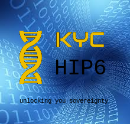



{: align=right width=320}
## KY-I the goal :

> “Providing every last person on the planet with a legal identity by 2030.”
<br>~&nbsp;Sustainable Development Goal 16.9

<br>
*note: this page is a simple markdown webpage ...*

<div id="first">{{ header | markdownify }}</div><br>


## Identity and KYC

<!-- see [*](https://decentralized-id.com/literature/self-sovereign-identity/ssi-principles-vs-characteristics/) -->

We are redefining the identity of future democracies
with computer assisted autonomous governance.

You have the option of creating a totally anonymous unique identity
which is randomly tokenized at each use or a secure public identity
everyone can share;


You can  obtain "physical" credentials you can attached to your identity 
at a later time, such that you can benefit from extra services
reserved to humans.
No more [captcha]({{site.search_url}}=CAPTCHA).

---

---


<div class="content">{{ intro | markdownify }}</div><br>


## The format

 We would like this identity to be addressable,<br>
for instance an *yID* like ```<michelc;penguin-à-vélo@1024>```
is understood by the system and is a direct link to me.

This identity need to be public, i.e. this is how the everyone remember us,
not how we want everyone to know us, so there is no vanity name here.
the addressable identity is constituted of 3 parts

1. Your public name, can be a nickname : this is how you are called
2. A memo this is how people will remember you, this field need to be "extra-ordinary"
3. A location field of domain, can be zip code or city


<div class="content">{{ format | markdownify }}</div><br>

<div class="content"><form action="{{site.cgibin}}/cgi-bin/register.pl" method="post">


---
Name: <input type="text" name="name" placeholder="your full public name"
onkeyup="updatename(this);" />
<br>Unique:
<input type="text" name="uniq" size=46 placeholder="A unique description of you, people might remember well *" required onkeyup="updateuniq(this);" />
<br>Zipcode: <input type="text" name="zip" onkeyup="updatezip(this);" />

### Your addressable identity is : *yID*=<b>&lt;<span id="name"></span>;<span id="uniq"></span>@<span id="zip"></span>&gt;</b>

<input type="radio" name="check" required> I undersigned, certify I am the person described here<br>
and the information provided are exact and true.<br>
signature <input type="password" name="sig" required>

---
### Contact information :

Tel: <input type="tel" name="phone" size=14><br>
email: <input type="email" name="email">

Additional information for lost ID recovery (optional)<br>
DoB: <input type="date" name="dob"><br>
PoB: <input type="name" name="pob" placeholder="Place of Birth"><br>
SSN: <input type="SSN" name="ssn" placeholder="last 4 digit of your SSN" >

<input type="submit">

{{ regform | markdownify }}
</form></div><br>

<script>
var trans = { 'à':'a','é':'e','è':'e','ç':'c' };
function updatename(name) {
   e = document.getElementById("name");
   e.innerHTML = name.value.replace(/[\!"£$%^&\)\(*+_={};:'@#~,.Š\/<>\" "\?|`¬\]\[]+/g,'-');
}
function updateuniq(uniq) {
   e = document.getElementById("uniq");
   var str = uniq.value.replace(/[àéèç]/g, function (x) { return trans[x]; } );
   e.innerHTML = str.replace(/[\!"£$%^&\)\(*+_={};:'@#~,.Š\/<>\" "\?|`¬\]\[]+/g,'-');
}
function updatezip(zip) {
   e = document.getElementById("zip");
   var str = zip.value.replace(/[àéèç]/g, function (x) { return trans[x]; } );
   e.innerHTML = str.replace(/[\!"£$%^&\)\(*+_={};:'@#~,.Š\/<>\" "\?|`¬\]\[]/g,'-');
}
</script>


# The infrastructure

In order to be federated and resilient to attack, our network need not to rely
on any institution, and there are run between trusted friends.
it takes very little resources to run the system and therefore we really appreciate
we all participate in making it real by downloading the application and participating
in validating the identities.

Participation means that keep a "fragment of the blockRing™ in sync on your device
and you are providing identities information to the network request.

You [participate][pp] is on a voluntary basis however people who don't to run the application
will simply contribute in supporting the cost of operation with a 0.02% transaction fee.

[pp]: participate.html



<div class="content">{{ infra | markdownify }}</div><br>

and a few links to :

-  a [README](README.html) file,
-  meeting [minutes](minutes.htm),
-  a [newsletter](newsletter.htm),
-  a [frama](frama.htm) page and
-  a [landing](landing.htm) one.


